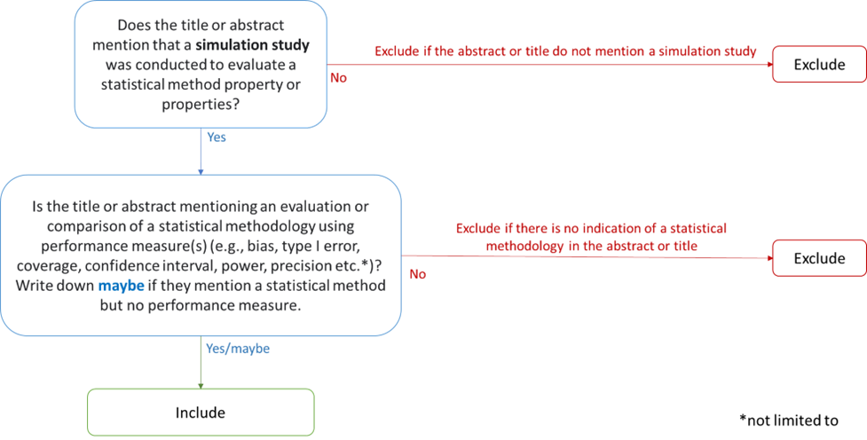

```{r setup, include=FALSE}
knitr::opts_chunk$set(echo = TRUE)
```

This document describes the methods and current results of the survey of simulation studies evaluating statistical methods in ecology and evolutionary biology literature.

# 1. Protocol

We preregistered a detailed protocol of the study on the Open Science Framework on 1st February 2023: <https://doi.org/10.17605/OSF.IO/5JUZP>

### Objectives

Using the ADEMP+ framework we will:

-   Survey the characteristics of simulation studies evaluating statistical methodologies in ecology and evolutionary biology.

-   Assess the reporting practices of simulation studies evaluating statistical methodologies in ecology and evolutionary biology.

# 2. Literature search

## Journal list

Journals defined as representative of ecology and evolutionary biology research were selected using categories from the Clarivate Journal Citation Reports™ (JCR) \@[@journalcitationreports(tm)2022]. Journals were selected with the following JCR category terms: "ECOLOGY" OR "EVOLUTIONARY BIOLOGY". 15 journals overlapped between the two categories and were coded as "Both". The full list of 228 journals selected from both categories is provided in the following table: <https://osf.io/u3t9b>.

```{r journalList, echo=FALSE, message=FALSE, warning=FALSE}
# rm(list=ls())
# 
# # Load libraries
# library(readr)
# library(dplyr)
# library(plyr)
# library(purrr)
# library(splitstackshape)
# library(devtools)
# library(knitr)
# library(tibble)
# library(kableExtra)
# 
# # Find directory with data
# #datdir <- rprojroot::find_rstudio_root_file("scoping")
# datdir <- rprojroot::find_rstudio_root_file("data")
# 
# 
# # Read list of journals
# # Files were downloaded from Web of Science on the 30/09/2022
# jcr_stats_path <- file.path(datdir, "JCR_JournalResults_09_2022_Statistics_and_Probability.csv")
# jcr_eco_path <- file.path(datdir, "JCR_JournalResults_09_2022_Ecology.csv")
# jcr_evo_path <- file.path(datdir, "JCR_JournalResults_09_2022_Evolutionary_Biology.csv")
# 
# # Load journal lists
# jcr_stats <- read_csv(jcr_stats_path, skip = 2)
# jcr_eco <- read_csv(jcr_eco_path, skip = 2)
# jcr_evo <- read_csv(jcr_evo_path, skip = 2)
# # Clean: delete empty rows and comment lines at the end of files
# jcr_stats <- jcr_stats[which(!is.na(jcr_stats$ISSN)),]
# jcr_eco <- jcr_eco[which(!is.na(jcr_eco$ISSN)),]
# jcr_evo <- jcr_evo[which(!is.na(jcr_evo$ISSN)),]
# 
# 
# # # Check how many journals overlap between each journal group
# # jcr_stats[which(jcr_stats$`Journal name` %in% jcr_eco$`Journal name`),]
# # jcr_eco$`Journal name`[which(jcr_eco$`Journal name` %in% jcr_evo$`Journal name`)]
# # jcr_evo$`Journal name`[which(jcr_evo$`Journal name` %in% jcr_eco$`Journal name`)]
# 
# 
# # get list of matching and unique journals in eco and evo groups
# ecoevo_match <- merge(jcr_eco[,-5], jcr_evo[,-5])
# ecoevo_match$Category <- "Both"
# ecoevo_notmatch <- jcr_eco[which(!jcr_evo$`Journal name` %in% ecoevo_match$`Journal name`),]
# 
# # get merged list of journals from eco and evo
# ecoevo_merged <- rbind(ecoevo_match, ecoevo_notmatch)
# 
# # save results
# write_csv(ecoevo_merged, "C:/Users/z5394590/OneDrive - UNSW/Documents/Projects/simsurvey/output/ecoevo_jcr_journal_list.csv", na="")
```

## Search strings


## Inclusion and exclusion criteria

-   Include publications between 01-01-2012 and 01-09-2022.
-   Include studies using simulation for the evaluation of statistical methodologies. Simulation studies that are not assessing methods in statistics will be excluded (for example simulation studies to assess ecological theories: <https://doi.org/10.1016/j.ecolmodel.2019.02.007>).
-   Simulation studies that are part of a review, commentary, letter to the editor or tutorial will be excluded (for example: <https://doi.org/10.1111/2041-210X.1380>) Included studies published in one of predefined journals in Table 1.
-   Include if: Full text is available and full text is in English

## Screening

### 1. Abstract and title screening



### 2. Full-text screening


## Results

Screening results and PRISMA diagram


# 3. Text extraction

A total of 103 articles were included after full text screening for text extraction.

Full data extraction is currently being completed by one reviewer (CW). A second reviewer (YY) will cross-check at least 20% of the extracted data, and disagreements between the two reviewers will be discussed and resolved. Any unresolved conflicts will be mediated by a third reviewer (SN). Information will be extracted from each article using a pre-piloted custom Google Form available here: <https://forms.gle/bWpDirw3owPJHcQq7>

The paper-level information will be recorded: paper title, journal name, DOI, and publication year. Information extracted from each simulation study will record reporting and characteristics information from each simulation step (see Table 1, Table 2, and Table 3).

For each question, a comment field is provided for recording the justification for the answer and adding any additional comments that may be necessary.

## Table 1: Planning steps questions and options for text extraction


## Table 2: Coding steps questions and options for text extraction


## Table 3: Analysis steps questions and options for text extraction


# 4. Data synthesis and analysis

This section describes future work (that is also described in the registered protocol document).

The information recorded in the Google form will be stored in a .csv Excel file for analysis and R statistical software will be used to produced graphs and data synthesis of extracted text.

#### a. Reporting practices results

The results from the reporting questions will be analysed by calculating the percentage of papers that answered "Yes," indicating that the simulation studies correctly reported a simulation step. The results from the questions about the reporting section will also be summarised as a percentage of the number of "Yes" recorded, which indicates the simulation study included a key step in the expected paper section. These percentages will be displayed in both graphical and tabular formats.

#### b. Simulation study characteristic results

We will compare the different types of data-generating mechanisms, statistical task(s), performance measures, software, and packages reported in each simulation study. The results will be summarised in tabular format using counts for each item's result and overall percentages. If the results reveal significant differences, we will conduct comparative analyses to explore the cause of these variations. Depending on the variability of the results, we may undertake additional analyses of the extracted data to understand the underlying reasons for any discrepancies.

#### c. Additional analyses

Depending on the results from the analyses of reporting and characteristic practices, additional analyses looking at differences between journals may be undertaken using comparative and descriptive statistics. We could expect to find differences between methodological journals vs non-methodological journals in ecology and evolutionary biology, with a higher reporting quality in the first group for example.

# Some important notes

## Example articles that are excluded from survey

**MCMC studies** Example of papers including an analaysis using Monte Carlo Markov Chain (MCMC):

**Genomic specific studies**

**Phylogenetic tree construction studies**

# Session info

```{r session_info, echo=FALSE, results='asis'}
library(dplyr)
library(rlang)
library(tidyverse)
#library(kable)
library(kableExtra)
# Get session information
sess_info <- sessionInfo()

# Create a data frame for main session information
main_info_df <- data.frame(
  Component = c("R", "Platform", "Language"),
  Details = c(sess_info$R.version$version.string,
              sess_info$platform,
              sess_info$R.version$language),
  stringsAsFactors = FALSE
)

# Create a data frame for packages and versions
packages_df <- data.frame(
  Package = names(sess_info$otherPkgs),
  Version = sapply(sess_info$otherPkgs, function(x) x$Version),
  stringsAsFactors = FALSE
)

# Create the main session information table
main_info_table <- kable(main_info_df, caption = "Main Session Information", align = "l", col.names = c("Component", "Details")) %>%
  kable_styling(bootstrap_options = c("striped", "hover", "condensed"), full_width = FALSE) %>%
  column_spec(1, bold = TRUE, width = "150px") %>%
  column_spec(2, width = "250px")

# Create the packages table
packages_table <- kable(packages_df, caption = "Loaded Packages", align = "l", col.names = c("Package", "Version")) %>%
  kable_styling(bootstrap_options = c("striped", "hover", "condensed"), full_width = FALSE) %>%
  column_spec(1, bold = TRUE, width = "150px") %>%
  column_spec(2, width = "150px")

# Print the tables
cat(main_info_table, sep = "\n")
cat("\n\n")  # Add some space between the tables
cat(packages_table, sep = "\n")
```
